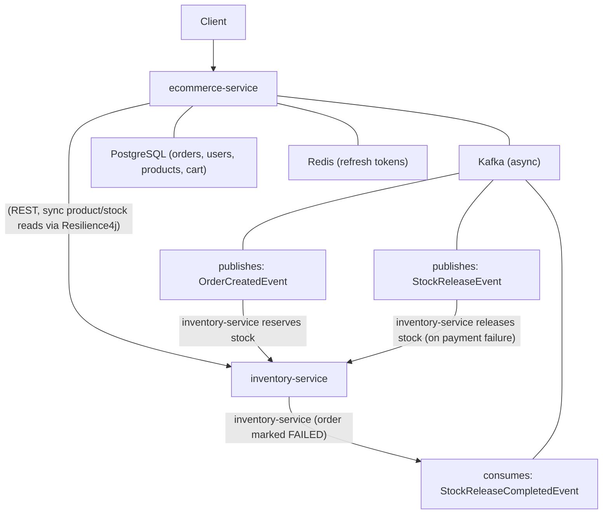

# E-Commerce Service:

Core customer-facing service for the platform — handles users, authentication, product catalog, cart, checkout, and order orchestration. 
Works alongside a separate inventory-service to reserve and release stock as part of an event-driven order fulfillment flow.

## Architecture

## Why both REST and Kafka? 
REST is used where an immediate response is needed (inventory creation, stock checks at checkout time, guarded by a Resilience4j circuit breaker with a fallback). 
Kafka is used for the order fulfillment saga itself — stock reservation and release — where reliability and at-least-once delivery matter more than immediate latency.

## Key design decisions:
* Transactional Outbox pattern — order creation and its corresponding event are written in a single DB transaction. A scheduled OutboxPublisher polls unpublished events and emits them to Kafka, avoiding the dual-write problem (DB commit succeeding while the Kafka publish fails, or vice versa).
* Idempotent Kafka consumers — inbound events are checked against a processed-event table before any side effect runs, so Kafka's at-least-once delivery (including outbox retries) can never cause duplicate processing.
* Choreographed saga with compensation — if payment fails after stock has been reserved, a StockReleaseEvent triggers inventory to restore stock, and the order is reconciled to a final FAILED state once release completes.
* Circuit breaker on inter-service calls — InventoryClient is wrapped with Resilience4j so a struggling/unavailable inventory service degrades gracefully instead of cascading failures back to the client.
* JWT access + Redis-backed refresh tokens — short-lived (1hr) JWT access tokens, with a rotating refresh token (7-day TTL) stored in Redis for re-issuing access tokens without forcing frequent re-logins.

## Tech stack:
Java 21 · Spring Boot 3.5 · Spring Data JPA · Spring Security · PostgreSQL · Apache Kafka · Redis · Resilience4j · JWT (JJWT) · Springdoc OpenAPI/Swagger · Maven

## API overview:
Area	Endpoint	Description
Auth	POST /auth/register	Register a new user
Auth	POST /auth/login	Authenticate, issue access + refresh token
Auth	POST /auth/refresh	Rotate refresh token, issue new access + refresh token
Auth	POST /auth/logout	Invalidate refresh token
Products	GET /products	List products
Products	GET /products/{id}	Get a product
Products	POST /products	Create a product
Products	PUT /products/{id}	Update a product
Products	DELETE /products/{id}	Delete a product
Cart	GET /cart	View current user's cart
Cart	POST /cart/items	Add an item to the cart
Cart	PUT /cart/items/{cartItemId}	Update item quantity
Cart	DELETE /cart/items/{itemId}	Remove an item
Cart	DELETE /cart	Clear the cart
Checkout	POST /cart/checkout	Validate stock, create order, kick off the fulfillment saga

Full interactive documentation is available via Swagger UI once the service is running (/swagger-ui.html).

## Running locally
Prerequisites
Java 21
Maven
PostgreSQL
Redis
Apache Kafka (with a broker reachable locally, e.g. via Docker Compose)
inventory-service running and reachable, for the full saga to work end-to-end

## Configuration
Set the following in application.yml / environment variables before running:

yaml
spring:
  datasource:
    url: jdbc:postgresql://localhost:5432/ecommerce
    username: <db-username>
    password: <db-password>
  data:
    redis:
      host: localhost
      port: 6379
  kafka:
    bootstrap-servers: localhost:9092

jwt:
  secret: <a sufficiently long HMAC secret>
  expiration: 3600000   # 1 hour, in ms

inventory-service:
  base-url: http://localhost:<inventory-service-port>

Build & run
bash
mvn clean install
mvn spring-boot:run

Swagger UI: http://localhost:<port>/swagger-ui.html

Known limitations / roadmap
No automated test suite yet beyond the default Spring Boot context-load test — unit/integration tests for the idempotent consumers and atomic stock-update logic are a priority addition.
Kafka consumers currently rely on default Spring Kafka retry behavior — explicit retry/backoff policy and a dead-letter topic are not yet configured.
Refresh tokens are currently stored unhashed in Redis; hashing before storage, and reuse-detection-triggered session revocation, are planned hardening steps.
